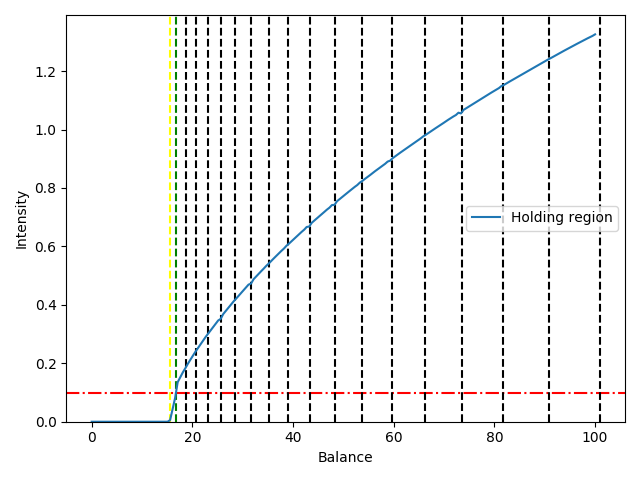
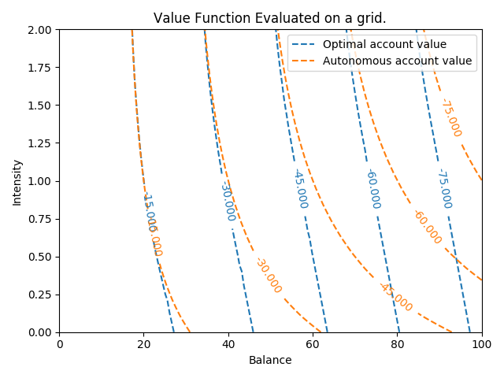

Dynamic Credit Collections
=====================================

This repository implements the algorithm described in [Dynamic Credit Collections](https://doi.org/10.1287/mnsc.2018.3070)
by N. Chehrazi, P. Glynn and T.A. Weber.

We assume that an account placed in collections

Quick Start
===========
Minimal working example that reproduces figures from the paper.

.. code:: python

    import dcc
    w_start = 100
    lstart = 1
    p = Parameters()
    w_array = np.linspace(0, 100, 40)
    l_array = np.linspace(0, 2, 10)
    oav = OAV(p, w_start, lstart, nx=200, ny=20)
    oav.plot_vf(plot_aav_flag=True)
    oav.plot_statespace()
    plt.show()
    oav.save('ref_parameters')
    ...
    
    
The autonomous account value can be investigated using the module aav.py.

   

